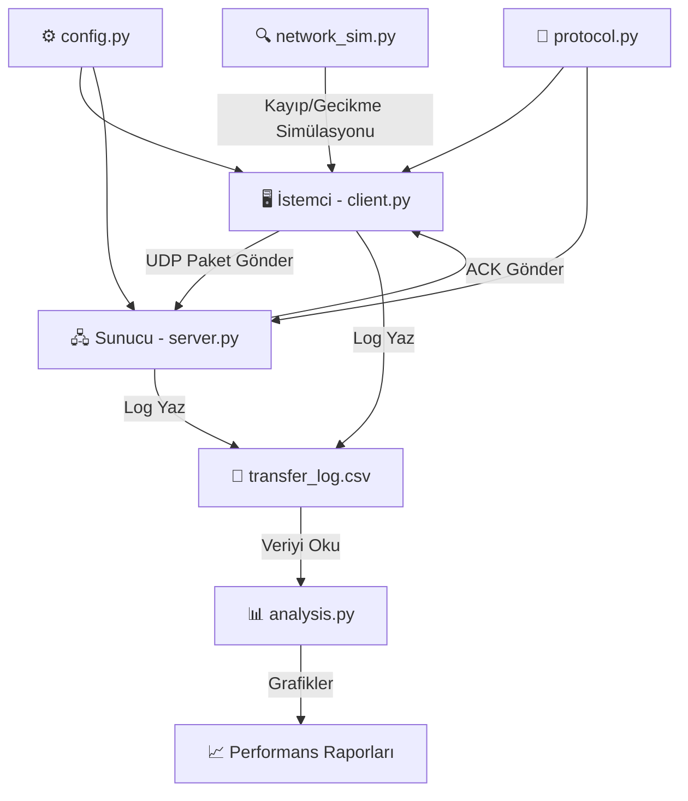

# 🗺️ NetProbe — Proje Yol Haritası
**Bursa Teknik Üniversitesi | Bilgisayar Ağları Dersi Dönem Projesi**  
*UDP Tabanlı Güvenilir Dosya Aktarımı, Trafik İzleme ve Ağ Performans Analiz Platformu*

---

## 📌 Projenin Özü (Ne Yapıyoruz?)

UDP, güvenilir bir protokol değildir — paket kayıpları, sıra bozukluğu, duplicate paketler yaşanabilir. Bu projede **TCP'nin yaptığı işi (güvenilirlik) UDP üzerinde kendimiz uygulama katmanında yazıyoruz**. Bunun üzerine trafik izleme ve performans ölçümü ekliyoruz.

```
[İstemci]  ──── UDP ────►  [Sunucu]
     ▲                          │
     └────── ACK ───────────────┘
  Sequence No, Timeout, Retransmission → Hepsini biz yazıyoruz.
```

---

## 🏗️ Mimari Genel Bakış



---

## 📁 Dosya Yapısı (Önerilen)

```
NetProbe-UDP-ReliableTransfer/
│
├── 📂 src/
│   ├── client.py          ← İstemci: dosya gönderir
│   ├── server.py          ← Sunucu: dosya alır, ACK gönderir
│   ├── protocol.py        ← Paket yapısı, pack/unpack fonksiyonları
│   ├── config.py          ← Tüm parametreler (timeout, paket boyutu vb.)
│   ├── logger.py          ← Log kayıt sistemi (CSV/JSON)
│   ├── analysis.py        ← Performans metrikleri + grafik üretimi
│   └── network_sim.py     ← (Opsiyonel) Kayıp/delay simülatörü
│
├── 📂 tests/
│   ├── test_protocol.py   ← Birim testleri
│   └── test_transfer.py   ← Entegrasyon testleri
│
├── 📂 data/
│   ├── test_files/        ← Test dosyaları (küçük, orta, büyük)
│   └── logs/              ← Transfer logları buraya yazılır
│
├── 📂 results/
│   └── graphs/            ← Üretilen grafikler
│
├── 📂 report/
│   └── netprobe_rapor.pdf ← Teknik rapor
│
└── README.md              ← Proje yapısı, çalıştırma, bağımlılıklar, GitHub linki
```

---

## 🔧 Bileşen Bileşen Ne Yapacağız?

### 1️⃣ `protocol.py` — Paket Protokol Tasarımı

**Ne yapar?** Paketlerin nasıl paketlenip açılacağını tanımlar. Hem client hem server bu modülü kullanır.

| Alan | Tür | Açıklama |
|---|---|---|
| `packet_type` | 1 byte | `DATA` = 0x01 veya `ACK` = 0x02 |
| `sequence_number` | 4 byte int | Paketin sıra numarası |
| `total_packets` | 4 byte int | Toplam paket sayısı |
| `payload_length` | 4 byte int | Veri uzunluğu (byte) |
| `checksum` | 32 byte | SHA-256 hash (bütünlük) |
| `payload` | değişken | Asıl veri |

```python
# protocol.py'de olacak fonksiyonlar
def create_data_packet(seq_num, total, payload) -> bytes: ...
def create_ack_packet(ack_num) -> bytes: ...
def parse_packet(raw_bytes) -> dict: ...
def compute_checksum(data: bytes) -> str: ...  # hashlib.sha256
```

> [!IMPORTANT]
> Birebir bu alanlar kullanılmak **zorunda değil** — proje föyü bunları öneri olarak sunuyor. Ama sequence number, ACK, checksum **zorunlu**.

---

### 2️⃣ `config.py` — Tüm Parametreler

**Ne yapar?** Sabit değerleri tek yerden yönetir. Deney sırasında sadece burası değiştirilir.

```python
# config.py içeriği
HOST = "127.0.0.1"
PORT = 5005
PACKET_SIZE = 1024          # bytes — deneyde değiştirilecek
TIMEOUT = 2.0               # saniye — deneyde değiştirilecek
MAX_RETRIES = 5             # zorunlu: maks 5 yeniden deneme
LOSS_SIMULATION = False     # yapay kayıp simülasyonu açık/kapalı
LOSS_RATE = 0.0             # 0.0 - 1.0 arası kayıp oranı
LOG_FILE = "data/logs/transfer_log.csv"
```

---

### 3️⃣ `server.py` — Sunucu

**Ne yapar?** UDP socket'i dinler, paketleri alır, ACK gönderir, dosyayı birleştirir, bütünlüğü doğrular.

```
server.py akışı:
1. UDP socket aç, porta bağlan (bind)
2. İlk paketi bekle
3. Her paket için:
   a. Paketi parse et (protocol.py)
   b. Checksum kontrol et
   c. Sequence number doğru mu?
      - Evet → veriye ekle, ACK gönder
      - Hayır (duplicate) → sadece ACK gönder, veriyi yazma
   d. Log'a yaz (logger.py)
4. Tüm paketler geldi mi?
   - Evet → dosyayı birleştir, son hash doğrula
5. Dosyayı diske kaydet
```

**Server'da kullanılacak Python modülleri:**
- `socket` — UDP soket
- `threading` — zaman aşımı yönetimi için
- `hashlib` — SHA-256 checksum
- `os`, `struct` — dosya ve byte işlemleri

---

### 4️⃣ `client.py` — İstemci

**Ne yapar?** Dosyayı parçalara böler, sırayla UDP paketi olarak gönderir, ACK bekler, timeout/retransmission uygular.

```
client.py akışı:
1. Dosyayı oku
2. PACKET_SIZE'a göre parçalara böl
3. Her paket için:
   a. Paketi oluştur (protocol.py)
   b. Gönder (socket.sendto)
   c. ACK bekle (socket.settimeout = TIMEOUT)
   d. ACK geldi mi?
      - Evet → sonraki pakete geç, log'a yaz
      - Hayır (timeout) → retry_count += 1
        - retry_count < MAX_RETRIES → yeniden gönder
        - retry_count == MAX_RETRIES → HATA: log'a yaz, kullanıcıya bildir
4. Tüm paketler gönderilince:
   a. Toplam süreyi hesapla
   b. Metrikleri log'a yaz
```

**⚠️ Zorunlu özellikler:**
- Her paket için **maks 5 yeniden gönderim** (MAX_RETRIES = 5)
- Pakette 5 denemede de başarı sağlanamazsa → aktarım başarısız kabul et, log'a yaz
- Duplicate ACK gelirse → yok say

---

### 5️⃣ `logger.py` — Olay Kayıt Sistemi

**Ne yapar?** Aktarım sırasında olan her şeyi CSV/JSON formatında kaydeder.

```python
# Her satır bir olayı temsil eder
# CSV Sütunları:
timestamp | event_type | seq_num | status | retry_count | elapsed_ms | notes
```

| `event_type` | Açıklama |
|---|---|
| `SENT` | Paket gönderildi |
| `ACK_RECEIVED` | ACK alındı |
| `TIMEOUT` | Timeout oluştu |
| `RETRANSMIT` | Yeniden gönderim yapıldı |
| `FAILED` | Maks deneme aşıldı |
| `TRANSFER_COMPLETE` | Aktarım tamamlandı |

---

### 6️⃣ `analysis.py` — Performans Analizi & Grafikler

**Ne yapar?** Log dosyasını okur, metrikleri hesaplar, grafikler üretir.

**Hesaplanacak metrikler:**

| Metrik | Formül / Açıklama |
|---|---|
| **Throughput** | Toplam gönderilen byte / Toplam süre (bps) |
| **Goodput** | Başarıyla alınan veri / Toplam süre (bps) |
| **Packet Loss Rate** | (Timeout sayısı / Toplam gönderim) × 100 |
| **Retransmission Rate** | Yeniden gönderilen paket / Toplam gönderilen |
| **Completion Time** | İlk paketten son ACK'e kadar geçen süre |
| **Ortalama RTT** | Her ACK için (gönderim zamanı - ACK zamanı) ortalaması |

**Üretilecek grafikler (matplotlib):**
- Throughput vs. Paket Boyutu
- Completion Time vs. Timeout Değeri
- Retransmission Rate vs. Kayıp Oranı
- Goodput vs. Dosya Boyutu

---

### 7️⃣ `network_sim.py` — Ağ Simülatörü *(Önerilir)*

**Ne yapar?** Gerçek kayıp olmasa bile yapay kayıp ve gecikme simüle eder. Deney senaryoları için şart.

```python
import random

def should_drop_packet(loss_rate: float) -> bool:
    """LOSS_RATE olasılığıyla paketi düşür."""
    return random.random() < loss_rate

def simulate_delay(min_ms=0, max_ms=100):
    """Yapay gecikme ekle."""
    import time
    delay = random.uniform(min_ms, max_ms) / 1000
    time.sleep(delay)
```

---

## 🧪 4 Deney Senaryosu (Zorunlu!)

Her deney için **aynı dosyayı** gönderin, sadece parametreyi değiştirin:

### Senaryo 1 — Paket Boyutunun Etkisi
| Değişken | Sabit | Sonuç |
|---|---|---|
| `PACKET_SIZE`: 256 / 512 / 1024 / 4096 byte | Timeout=2s, Loss=0% | Throughput ve Completion Time nasıl değişiyor? |

### Senaryo 2 — Timeout Değerinin Etkisi
| Değişken | Sabit | Sonuç |
|---|---|---|
| `TIMEOUT`: 0.5 / 1.0 / 2.0 / 5.0 saniye | PacketSize=1024, Loss=5% | Gereksiz retransmission ve gecikme nasıl değişiyor? |

### Senaryo 3 — Kayıp Oranının Etkisi
| Değişken | Sabit | Sonuç |
|---|---|---|
| `LOSS_RATE`: %0 / %5 / %15 / %30 | PacketSize=1024, Timeout=2s | Sistem yüksek kayıplarda nasıl davranıyor? |

### Senaryo 4 — Dosya Boyutunun Etkisi
| Değişken | Sabit | Sonuç |
|---|---|---|
| Dosya: 10KB / 100KB / 1MB / 10MB | PacketSize=1024, Timeout=2s, Loss=0% | Küçük vs büyük dosyalarda verimlilik? |

> [!NOTE]
> Her senaryo için sadece sonuç üretmek **yetmez**. **Neden böyle sonuç çıktığını** açıklamak zorunlu. Örneğin: *"Timeout düşürünce retransmission arttı çünkü ACK dönmeden önce paket yeniden gönderildi."*

---

## 🏆 Bonus Özellikler *(Opsiyonel — Puan Artırır)*

| Özellik | Açıklama | Zorluk |
|---|---|---|
| **Sliding Window** | Stop-and-wait yerine birden fazla paket aynı anda uçuşta | ⭐⭐⭐ |
| **Go-Back-N veya Selective Repeat** | Pencere tabanlı hata kurtarma | ⭐⭐⭐⭐ |
| **Gerçek zamanlı dashboard** | Aktarım sırasında canlı metrik görüntüleme | ⭐⭐ |
| **TCP ile karşılaştırma** | Aynı senaryoları TCP ile çalıştırıp farkları raporla | ⭐⭐ |
| **Çoklu istemci** | Sunucu birden fazla istemciye aynı anda hizmet versin | ⭐⭐⭐ |
| **Wireshark / pcap analizi** | Gerçek paket yakalama ve analiz | ⭐⭐ |
| **Şifreleme / Sıkıştırma** | Payload'a basit XOR şifreleme veya gzip sıkıştırma | ⭐⭐ |

---

## 📊 Değerlendirme Rubriği

| Kriter | Ağırlık | Ne Gerekiyor? |
|---|---|---|
| 🟢 Temel sistem çalışması | **%20** | UDP client-server yapısı + dosya aktarımı temel çalışır |
| 🔵 Güvenilir aktarım | **%20** | Sequence no + ACK + Timeout + Retransmission doğru çalışır |
| 🟡 Trafik izleme | **%15** | Olaylar kaydediliyor ve anlamlı ölçümler yapılıyor |
| 🟠 Performans analizi | **%20** | Throughput, Goodput, Completion Time teknik yorumla sunuluyor |
| 🔴 Kod kalitesi | **%10** | Modüler, yorumlu, okunabilir |
| 📝 Rapor kalitesi | **%10** | Tablo/grafik + teknik yorum + mimari anlatım |
| 🎤 Sunum & Demo | **%5** | Çalışan demo + soru-cevap |

---

## 📋 Teknik Rapor Bölümleri

1. Giriş
2. Problem tanımı
3. Sistem mimarisi
4. Protokol tasarımı *(paket yapısı, alanlar)*
5. Gerçekleme detayları *(hangi dil, kütüphane, neden bu tasarım)*
6. Deney ortamı *(makine, OS, ağ koşulları)*
7. Performans metrikleri *(grafikler ve tablolar)*
8. Sonuçlar ve tartışma *(her deneyin teknik açıklaması)*
9. Karşılaşılan sorunlar ve çözümler
10. Sonuç ve gelecekteki geliştirmeler

> [!IMPORTANT]
> Rapor uzunluğu: **8-12 sayfa** (kapak ve ekler hariç). PDF formatında teslim.

---

## 📦 Teslim Kontrol Listesi

- [ ] `client.py` — çalışır durumda
- [ ] `server.py` — çalışır durumda
- [ ] `analysis.py` — grafikler üretiyor
- [ ] `README.md` — proje yapısı + çalıştırma adımları + GitHub linki
- [ ] Log dosyaları (`data/logs/`)
- [ ] Performans grafikleri (`results/graphs/`)
- [ ] Teknik rapor PDF (`report/netprobe_rapor.pdf`)
- [ ] Tüm bunlar tek `.zip` dosyasında
- [ ] GitHub deposu oluşturulmuş ve README'de linki var

---

## 🛠️ Teknoloji Yığını

| Araç | Kullanıldığı Yer |
|---|---|
| `socket` | UDP soket açma, gönderim ve alım |
| `struct` | Paket byte'larını pack/unpack etmek |
| `hashlib` | SHA-256 checksum hesaplama |
| `threading` | Timeout için zamanlayıcı / sunucu thread'i |
| `time` | RTT ve süre ölçümü |
| `csv` / `json` | Log dosyası yazımı |
| `matplotlib` | Grafik üretimi |
| `pandas` | Log verisi analizi (opsiyonel ama pratik) |
| `random` | Yapay kayıp simülasyonu |
| `os`, `sys` | Dosya yönetimi |

---

## 🚦 Geliştirme Sırası (Adım Adım)

```
AŞAMA 1 ── Temel İletişim
  └─ config.py → protocol.py → server.py (sadece al/ACK gönder) → client.py (gönder/ACK bekle)
  
AŞAMA 2 ── Güvenilir Aktarım
  └─ Timeout ekle → Retransmission ekle (max 5) → Duplicate detection → Checksum doğrulama
  
AŞAMA 3 ── Loglama
  └─ logger.py yaz → client ve server'a entegre et → CSV dosyasına yaz

AŞAMA 4 ── Performans Analizi
  └─ analysis.py yaz → metrikleri hesapla → grafikleri üret

AŞAMA 5 ── Deneyler
  └─ 4 senaryo × farklı parametreler → grafikler → yorumlar

AŞAMA 6 ── Rapor & Teslim
  └─ Teknik rapor yaz → README hazırla → GitHub'a yükle → .zip oluştur
```

---

*📅 Son güncelleme: Mart 2026 | Bursa Teknik Üniversitesi — Bilgisayar Ağları Dönem Projesi*
